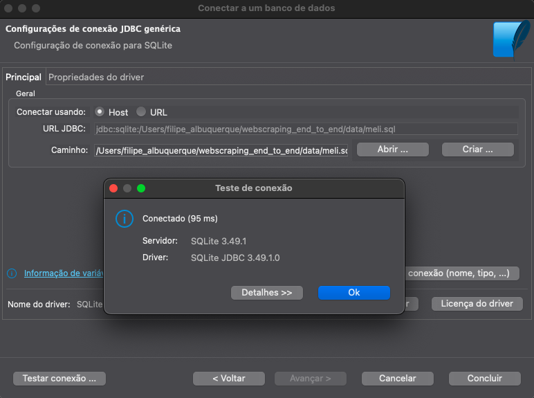
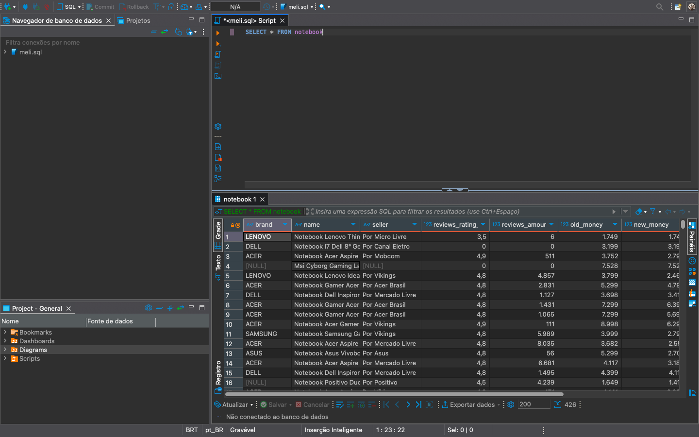
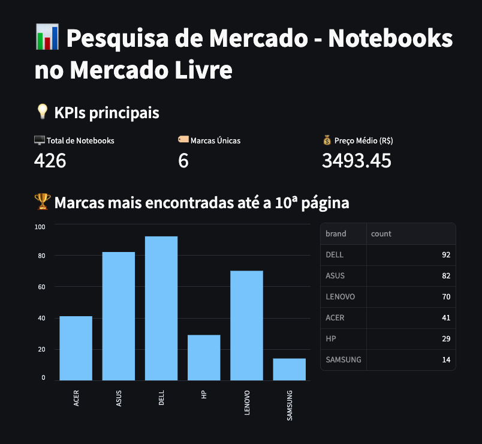

# WebScraping com Python

Um projeto completo de análise de mercado que coleta, processa e visualiza dados sobre notebooks no Mercado Livre Brasil.

## Problema de Negócio

A Samsung necessita de uma pesquisa de mercado aprofundada na categoria de notebooks para tomar decisões estratégicas, como ela se compara aos concorrentes dentro de MarketPlaces, para esse feito ela decidiu que precisa coletar dados,
meu papel é realizar uma coleta desses dados nesses sites, neste caso optei pelos dados do MarketPlace do MercadoLivre, como todo projeto, precisamos entender o que o cleinte deseja
nesse caso A empresa deseja:

* Realizar uma análise completa da concorrência de notebooks em marketplaces, especificamente no Mercado Livre
* Coletar dados estruturados (Nome, Marca, Preço, Avaliações, Vendedor, etc.)
* Desenvolver um sistema de WebScraping para obtenção automatizada dos dados
* Armazenar as informações em um banco de dados SQL para consultas futuras
* Criar um dashboard interativo para visualização e análise dos insights obtidos

Uma vez compreendido o desejo da empresa e o problema de negócio podemos prosseguir com a explicação de todo o processo feito para conseguir tais informações.

Este projeto é uma solução end-to-end de webscraping, seguindo o formato Extract, Transform e Load (ETL).

## Processo de Extract (Extração)

Utilizei o framework Scrapy para webscraping. O spider `notebook.py` foi programado para navegar pela página de notebooks do Mercado Livre e extrair informações detalhadas.

Um dos maiores desafios foi compreender o padrão de URLs do Mercado Livre. Identifiquei que a navegação seguia um padrão específico:
- Para a segunda página: `.../notebook_Desde_49_NoIndex_True`
- Para as páginas seguintes: `.../notebook_Desde_{49+(página-1)*48}_NoIndex_True`

Este padrão está implementado no bloco condicional ao final do spider, permitindo a navegação automática entre as páginas:

```python
if self.page_count < self.max_page:
    # Verificamos se o contador de páginas está abaixo do limite máximo definido (10 páginas)
    if self.page_count == 1:
        # Tratamento especial para a segunda página (depois da primeira)
        # A segunda página sempre usa um offset fixo de 49 produtos
        next_page = "https://lista.mercadolivre.com.br/informatica/portateis-acessorios/notebooks/notebook_Desde_49_NoIndex_True"
    else:
        # Para as páginas subsequentes (terceira em diante)
        # Calculamos o offset com base em uma fórmula identificada no padrão do site:
        # - Primeira página: sem offset
        # - Segunda página: offset de 49
        # - Terceira página em diante: 49 + (número_da_página - 1) * 48
        next_offset = 49 + (self.page_count - 1) * 48
        next_page = f"https://lista.mercadolivre.com.br/informatica/portateis-acessorios/notebooks/notebook_Desde_{next_offset}_NoIndex_True"
    
    # Incrementamos o contador de páginas para a próxima iteração
    self.page_count += 1
    
    # Criamos uma nova requisição para a próxima página e a adicionamos à fila do Scrapy
    # O callback self.parse faz com que a mesma função seja chamada para processar os resultados
    yield scrapy.Request(url=next_page, callback=self.parse)
```

Este sistema funciona porque:
1. Inicializamos `page_count = 1` e `max_page = 10` no início da classe
2. A condição `if self.page_count < self.max_page` limita a coleta a no máximo 10 páginas
3. Tratamos a primeira transição (página 1 → página 2) de forma especial, pois o Mercado Livre usa um offset fixo de 49
4. Para as próximas páginas, calculamos o offset dinamicamente baseado no padrão descoberto
5. Incrementamos o contador após cada página processada
6. Usamos o `yield` para gerar uma nova requisição que será processada pelo Scrapy

Outro aspecto importante foi a extração de preços. O Mercado Livre frequentemente exibe dois valores: o preço original (`old_money`) e o preço promocional (`new_money`). Extraí esses valores usando:

```python
prices = product.css('span.andes-money-amount__fraction::text').getall()
'old_money': prices[0] if len(prices) > 0 else None,
'new_money': prices[1] if len(prices) > 1 else None
```

### Processo de Transform (Transformação)

A transformação dos dados foi realizada com a biblioteca Pandas. As principais operações incluíram:

1. **Tratamento de dados nulos**:
   ```python
   df['old_money'] = df['old_money'].fillna('0')
   df['new_money'] = df['new_money'].fillna('0')
   df['reviews_rating_number'] = df['reviews_rating_number'].fillna('0')
   df['reviews_amount'] = df['reviews_amount'].fillna('0')
   ```

2. **Filtragem de preços** - mantendo apenas notebooks entre R$1.000 e R$10.000:
   ```python
   df = df[
       (df['old_money'] >= 1000) & (df['old_money'] <= 10000) &
       (df['new_money'] >= 1000) & (df['new_money'] <= 10000)
   ]
   ```

3. **Conversão de tipos de dados**:
   ```python
   df['old_money'] = df['old_money'].astype(float)
   df['new_money'] = df['new_money'].astype(float)
   df['reviews_rating_number'] = df['reviews_rating_number'].astype(float)
   df['reviews_amount'] = df['reviews_amount'].astype(int)
   ```

### Processo de Load (Carregamento)

O carregamento dos dados foi feito com SQLite:

```python
conn = sqlite3.connect('data/meli.sql')
df.to_sql('notebook', conn, if_exists='replace', index=False)
```

#### Teste de Conexão com DBeaver

Após o carregamento dos dados, realizei testes de conexão utilizando o DBeaver para verificar se o banco de dados foi criado corretamente e se a conexão poderia ser estabelecida.


*Figura 1: Configuração da conexão com o banco de dados SQLite no DBeaver.*

#### Checagem dos Dados no DBeaver

Para validar a integridade dos dados carregados, executei uma consulta simples no DBeaver:

```sql
SELECT * FROM notebook
```

Esta consulta retornou todos os registros da tabela, permitindo verificar se os dados foram corretamente carregados e estruturados.


*Figura 2: Resultados da consulta SQL exibindo os dados coletados dos notebooks.*

### Dashboard com Streamlit

Desenvolvi um dashboard interativo com Streamlit que apresenta:
- KPIs principais: total de notebooks, marcas únicas e preço médio
- Gráficos de barras das marcas mais frequentes
- Análise de preço médio por marca
- Satisfação média por marca baseada nas avaliações

#### Código do Dashboard

```python
# import
import streamlit as st
import pandas as pd
import sqlite3

# Conectar ao banco de dados SQLite
conn = sqlite3.connect('data/meli.sql')

# Carregar os dados da tabela 'notebooks' em um DataFrame pandas
df = pd.read_sql_query("SELECT * FROM notebook", conn)

# Fechar a conexão com o banco de dados
conn.close()

# Título da aplicação
st.title('📊 Pesquisa de Mercado - Notebooks no Mercado Livre')

# Melhorar o layout com colunas para KPIs
st.subheader('💡 KPIs principais')
col1, col2, col3 = st.columns(3)

# KPI 1: Número total de itens
total_itens = df.shape[0]
col1.metric(label="🖥️ Total de Notebooks", value=total_itens)

# KPI 2: Número de marcas únicas
unique_brands = df['brand'].nunique()
col2.metric(label="🏷️ Marcas Únicas", value=unique_brands)

# KPI 3: Preço médio novo (em reais)
average_new_price = df['new_money'].mean()
col3.metric(label="💰 Preço Médio (R$)", value=f"{average_new_price:.2f}")

# Marcas mais frequentes
st.subheader('🏆 Marcas mais encontradas até a 10ª página')
col1, col2 = st.columns([4, 2])
top_brands = df['brand'].value_counts().sort_values(ascending=False)
col1.bar_chart(top_brands)
col2.write(top_brands)

# Preço médio por marca
st.subheader('💵 Preço médio por marca')
col1, col2 = st.columns([4, 2])
df_non_zero_prices = df[df['new_money'] > 0]
average_price_by_brand = df_non_zero_prices.groupby('brand')['new_money'].mean().sort_values(ascending=False)
col1.bar_chart(average_price_by_brand)
col2.write(average_price_by_brand)

# Satisfação média por marca
st.subheader('⭐ Satisfação média por marca')
col1, col2 = st.columns([4, 2])
df_non_zero_reviews = df[df['reviews_rating_number'] > 0]
satisfaction_by_brand = df_non_zero_reviews.groupby('brand')['reviews_rating_number'].mean().sort_values(ascending=False)
col1.bar_chart(satisfaction_by_brand)
col2.write(satisfaction_by_brand)
```

#### Visualização do Dashboard

Abaixo está uma captura de tela do dashboard em funcionamento:


*Figura 3: Dashboard interativo criado com Streamlit mostrando os principais insights dos dados coletados.*

## Estrutura do Projeto

```
📦
├── data                 # Contém os dados coletados e o banco SQLite
│   └── data.jsonl       # Dados extraídos em formato JSONL
│   └── meli.sql         # Banco de dados SQLite com dados processados
├── src                  # Código-fonte do projeto
│   ├── extraction       # Scripts de coleta de dados (Scrapy)
│   │   └── coleta       # Projeto Scrapy
│   │       ├── spiders  # Spiders para extração de dados
│   │       │   └── notebook.py # Spider específico para notebooks
│   │       ├── items.py        # Definição dos itens a serem coletados
│   │       └── settings.py     # Configurações do Scrapy
│   ├── transformLoad    # Scripts de processamento e carregamento
│   │   └── main.py      # Script de ETL para tratar os dados coletados
│   └── dashboard        # Código da interface de visualização
│       └── app.py       # Aplicação Streamlit para visualização dos dados
└── README.md            # Este arquivo
```

## Como Usar

### Pré-requisitos

- Python 3.8+
- pip (gerenciador de pacotes do Python)
- Bibliotecas: Scrapy, Pandas, SQLite3, Streamlit

### Instalação

```bash
# Clone o repositório
git clone https://github.com/seu-usuario/meli-market-research.git
cd meli-market-research

# Instale as dependências
pip install -r requirements.txt
```

### Executando o Projeto

#### 1. Extração de Dados (Coleta)

```bash
cd src/extraction
scrapy crawl notebook -o ../../data/data.jsonl
```

Este comando inicia o spider que coleta informações de até 10 páginas de resultados de notebooks no Mercado Livre.

#### 2. Transformação e Carregamento dos Dados

```bash
cd ../transformLoad
python main.py
```

Este script limpa os dados, remove valores inválidos, formata os preços corretamente e carrega tudo em um banco de dados SQLite.

#### 3. Visualização dos Dados

```bash
cd ../dashboard
streamlit run app.py
```

Este comando inicia o dashboard Streamlit que exibe graficamente os insights extraídos dos dados.

## Insights Disponíveis

O dashboard fornece as seguintes informações:

- Total de notebooks analisados
- Número de marcas disponíveis
- Preço médio dos notebooks
- Ranking das marcas mais populares
- Comparação de preços médios por marca
- Satisfação dos clientes por marca (avaliações)

## Tecnologias Utilizadas

- **Scrapy**: Framework para extração de dados
- **Pandas**: Biblioteca para manipulação e análise de dados
- **SQLite**: Sistema de gerenciamento de banco de dados relacional
- **DBeaver**: Ferramenta universal de banco de dados para checagem dos dados e teste de conexão 
- **Streamlit**: Biblioteca para criação de aplicações web interativas

## Possíveis Melhorias Futuras

- Implementar coleta automática agendada
- Adicionar análise de sentimento das avaliações
- Incluir comparação histórica de preços
- Expandir para outras categorias de produtos
- Implementar alertas de preço

## Licença

Este projeto está licenciado sob a licença MIT - veja o arquivo LICENSE para detalhes.

## Autor

Filipe Albuquerque - [filipi_98@hotmail.com](mailto:filipi_98@hotmail.com)

---

⭐️ Se este projeto te ajudou, considere dar uma estrela! ⭐️
